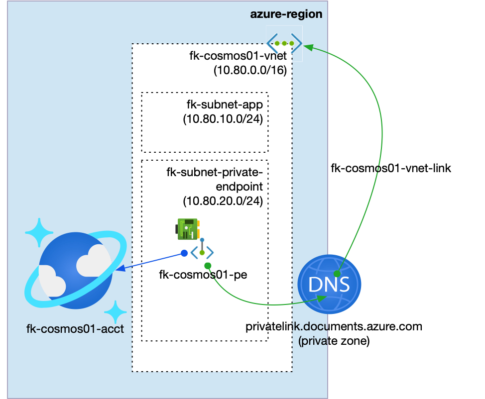
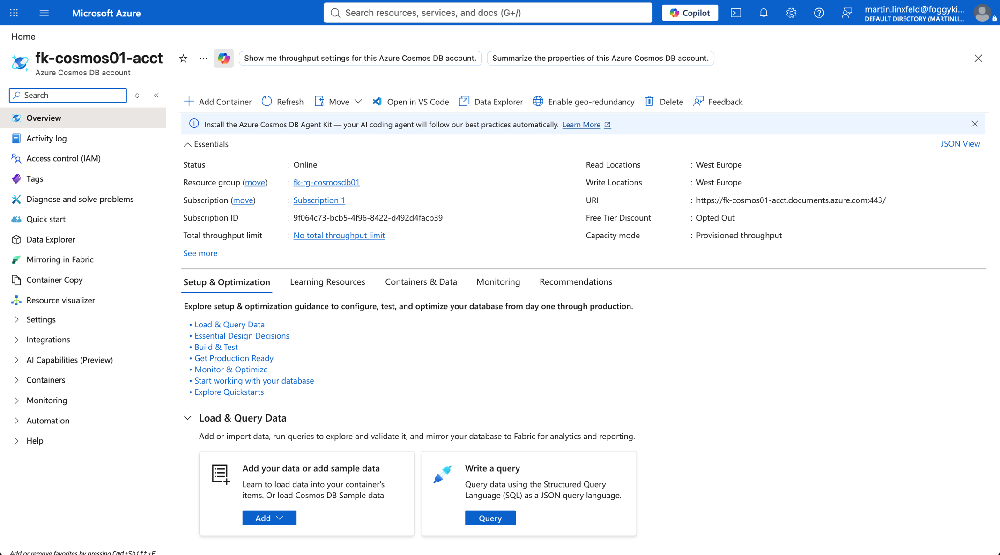
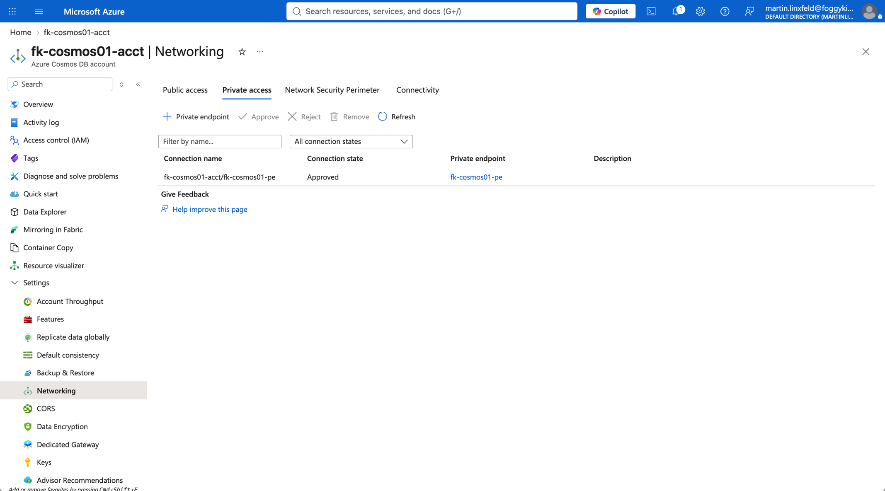
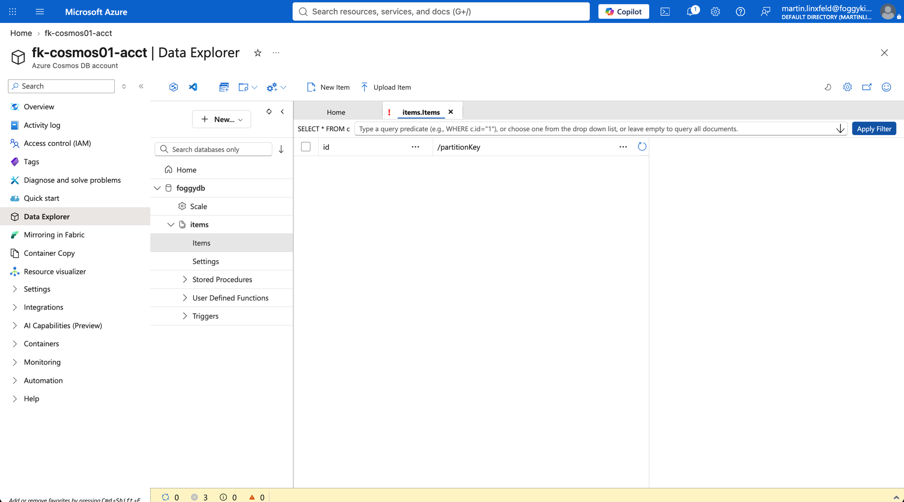
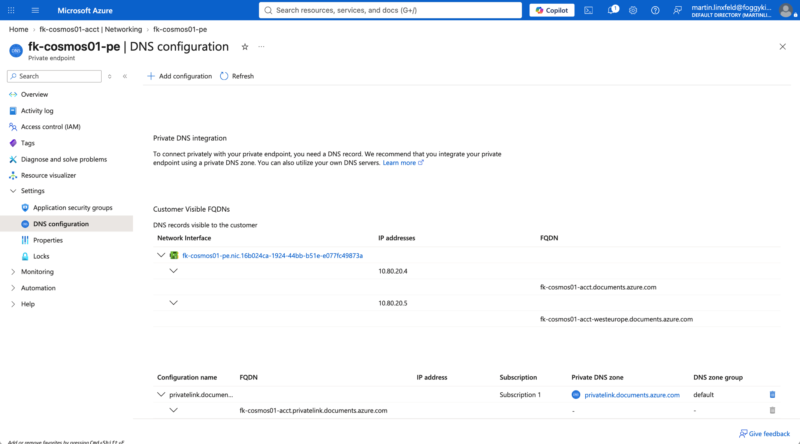
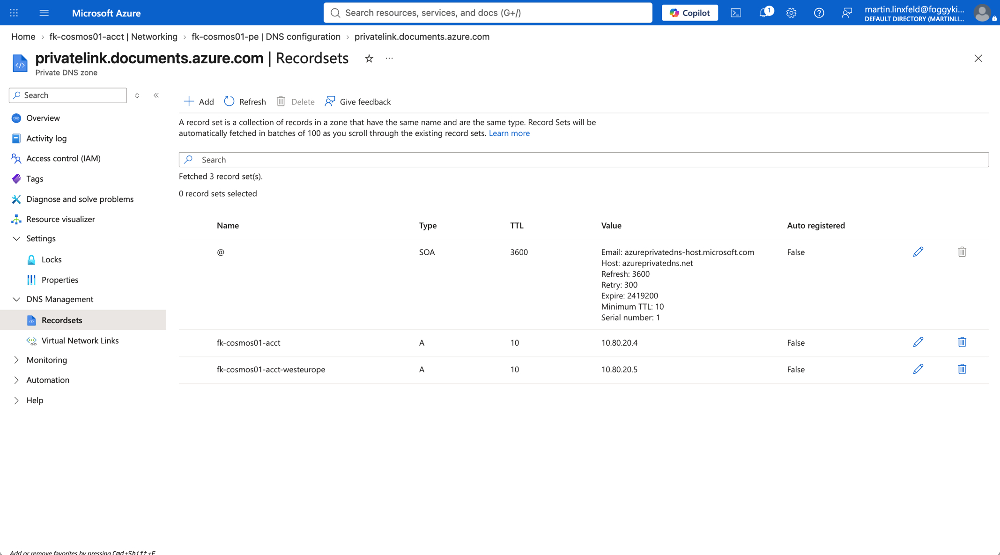

# Example 01: Azure Cosmos DB Private Endpoint

In this Azure Cosmos DB example, we deploy a **Cosmos DB SQL API account**, one SQL database, and one SQL container using **Terraform/OpenTofu**, then expose the account privately through **Azure Private Link**.
The Private Endpoint is created in a dedicated subnet and integrated with the recommended Cosmos DB Private DNS Zone for SQL API.

This example focuses on the **Private Endpoint deployment path**, where the Cosmos DB account is composed with dedicated FoggyKitchen networking, Private DNS, and Private Endpoint modules.

---

## Architecture Overview



This deployment creates:

- A dedicated **Azure Resource Group**
- One **Azure VNet** using `terraform-az-fk-vnet`
- One application subnet for future client workloads
- One subnet prepared for Private Endpoints
- One **Private DNS Zone** using `terraform-az-fk-private-dns`
- One **Cosmos DB SQL API account** using the local `terraform-az-fk-cosmosdb` module
- One Cosmos DB SQL database named `foggydb`
- One Cosmos DB SQL container named `items`
- One **Private Endpoint** using `terraform-az-fk-private-endpoint`
- One Private DNS Zone Group attached to the Private Endpoint

This is the most direct way to understand how the Cosmos DB module can be composed with Private Link while keeping endpoint and DNS concerns outside the root database module.

---

## Network Layout

- **VNet CIDR:** `10.80.0.0/16`
- **Application subnet:** `10.80.10.0/24`
- **Private Endpoint subnet:** `10.80.20.0/24`
- **Private Link subresource:** `Sql`
- **Private DNS Zone:** `privatelink.documents.azure.com`

The Cosmos DB account remains an Azure PaaS resource.
Only the Private Endpoint network interface is placed inside the `fk-subnet-private-endpoint` subnet.

---

## Deployment Steps

Copy the example variables file:

```bash
cp terraform.tfvars.example terraform.tfvars
```

Initialize and apply the Terraform/OpenTofu configuration:

```bash
tofu init
tofu plan
tofu apply
```

After a successful deployment, OpenTofu will output:

- The Cosmos DB account ID
- The Cosmos DB account endpoint
- The created SQL database IDs
- The created SQL container IDs
- The Private Endpoint ID

---

## Runtime Notes

After deployment, the Cosmos DB account should:

- have public network access disabled
- be associated with a Private Endpoint
- resolve through `privatelink.documents.azure.com`
- expose the `foggydb` SQL database
- expose the `items` SQL container
- accept private connectivity from clients with network path to the Private Endpoint subnet

The Cosmos DB SQL API Private Endpoint target subresource is `Sql`.
This example does not configure IP firewall rules because the intended access path is private-only.

---

## Azure Console And Runtime Verification

### Cosmos DB Account Overview

In the Azure portal, verify that the Cosmos DB account exists in the expected resource group and region, and that the account endpoint is available.



### Cosmos DB Networking

Confirm that the Cosmos DB account uses Private access and that the Private Endpoint connection is approved.



### Cosmos DB Data Explorer

Confirm that the `foggydb` SQL database and `items` SQL container exist in Data Explorer.



### Private Endpoint DNS Configuration

Confirm that the Private Endpoint DNS configuration exposes the Cosmos DB FQDNs and private IP addresses from the Private Endpoint subnet.



### Private DNS Zone Record Set

Confirm that the Private DNS Zone contains `A` records for the Cosmos DB account that point to Private Endpoint IP addresses.



---

## Cleanup

To remove all resources created by this example:

```bash
tofu destroy
```

---

## Summary

This example demonstrates:

- How to deploy a **Cosmos DB SQL API account**, SQL database, and SQL container using Terraform/OpenTofu
- How to compose the Cosmos DB module with `terraform-az-fk-private-endpoint`
- How to use `terraform-az-fk-private-dns` for Private Endpoint DNS integration
- How to use the Cosmos DB SQL API Private Link subresource `Sql`
- How to keep Private Endpoint concerns outside the root Cosmos DB module

---

## Learn More

Visit [FoggyKitchen.com](https://foggykitchen.com/) for Azure, OCI, multicloud, and Terraform/OpenTofu learning resources.

---

## License

Licensed under the **Universal Permissive License (UPL), Version 1.0**.
See [LICENSE](../../LICENSE) for more details.

---

© 2026 [FoggyKitchen.com](https://foggykitchen.com) - Cloud. Code. Clarity.
