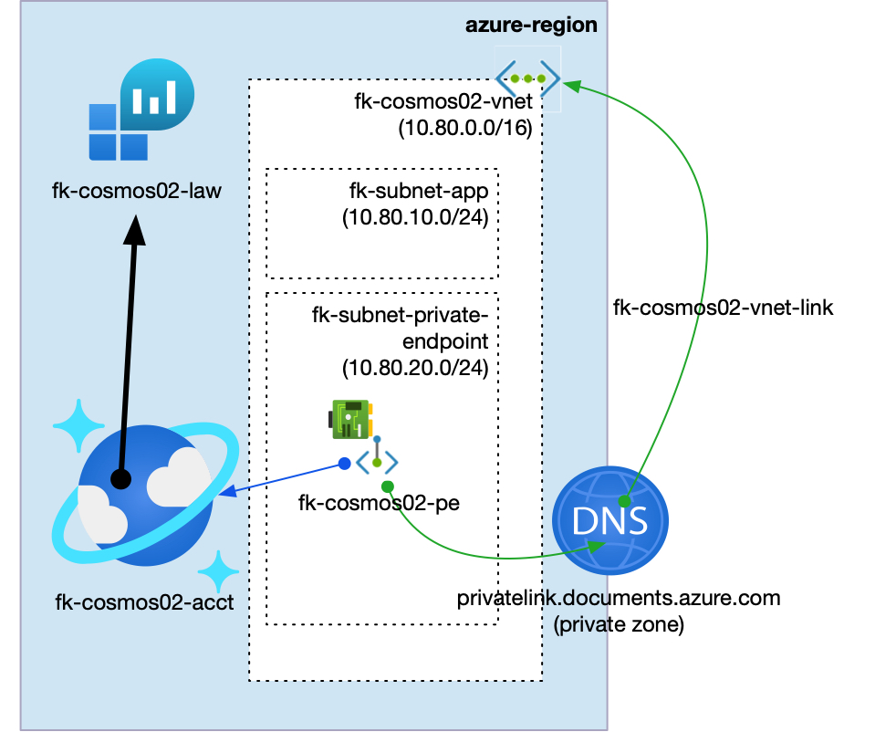
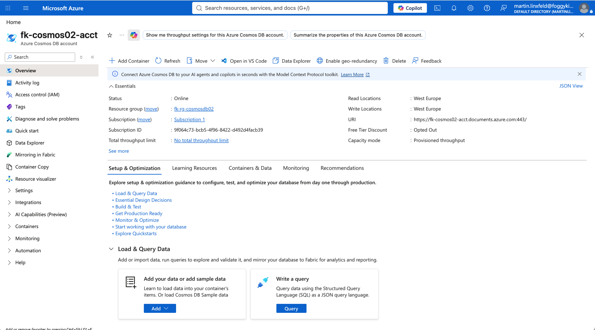
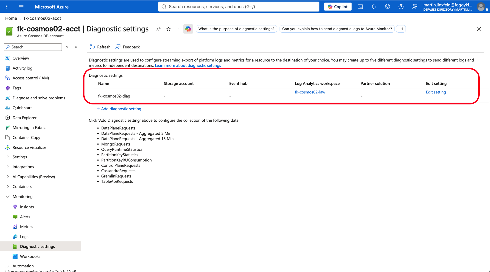
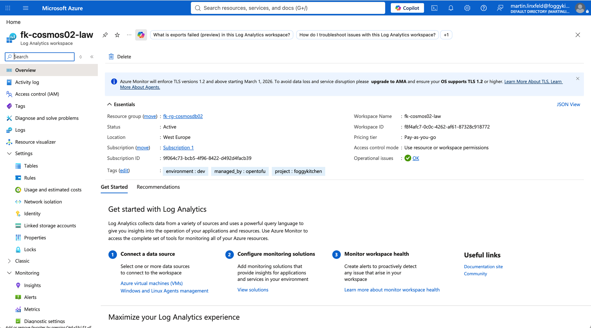
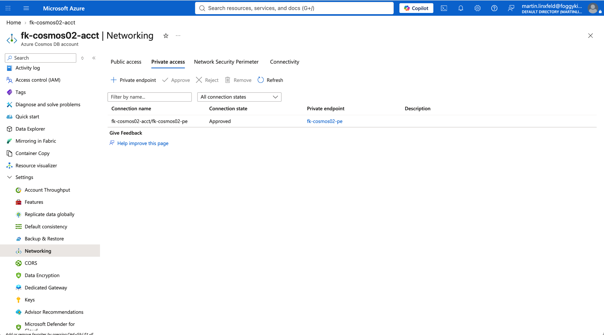
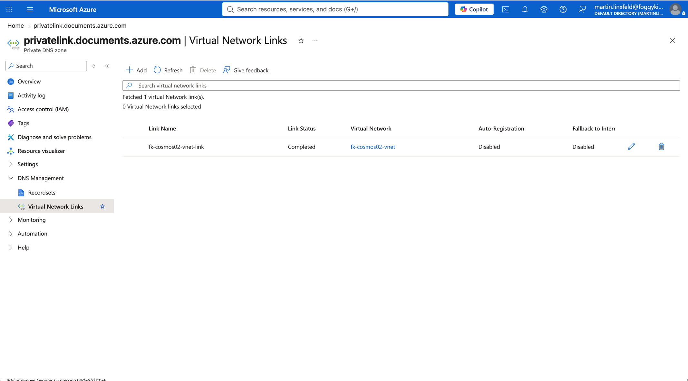

# Example 02: Diagnostic Settings

In this second Cosmos DB example, we deploy an **Azure Cosmos DB SQL API account** using
**Terraform/OpenTofu** and send Cosmos DB platform logs and metrics to an **Azure Log Analytics
Workspace**.
The account keeps the private-access baseline from Example 01 with a Private Endpoint, Private DNS
Zone, and public network access disabled.

This example creates the workspace with `terraform-az-fk-log-analytics`. The Cosmos DB module owns
the diagnostic setting so the lab demonstrates the `diagnostic_settings` input directly.

---

## Architecture Overview



This deployment creates:

- A dedicated **Azure Resource Group**
- One **Log Analytics Workspace** using `terraform-az-fk-log-analytics`
- One **Azure VNet** using `terraform-az-fk-vnet`
- One application subnet for future client workloads
- One subnet prepared for Private Endpoints
- One **Private DNS Zone** using `terraform-az-fk-private-dns`
- One **Azure Cosmos DB account** using the local `terraform-az-fk-cosmosdb` module
- One **Azure Monitor diagnostic setting** using Cosmos DB resource-specific logs and `Requests` metrics
- One sample SQL database named `foggydb`
- One sample SQL container named `items`
- One **Private Endpoint** using `terraform-az-fk-private-endpoint`
- One Private DNS Zone Group attached to the Private Endpoint

This example demonstrates the Cosmos DB observability pattern where the workspace is composed
outside the database module, the Cosmos DB module attaches diagnostics to the account, and private
connectivity stays explicit in the example composition layer.

---

## Deployment Steps

Copy the example variables file:

```bash
cp terraform.tfvars.example terraform.tfvars
```

Log Analytics retention and daily quota use low-cost lab defaults.

Initialize and apply the Terraform/OpenTofu configuration:

```bash
tofu init
tofu plan
tofu apply
```

After a successful deployment, OpenTofu will output:

- The Cosmos DB account ID
- The Cosmos DB endpoint
- The Log Analytics Workspace ID and name
- The diagnostic setting IDs
- The created SQL database and container IDs
- The Private Endpoint ID

---

## Runtime Notes

After deployment, the Cosmos DB account should:

- have public network access disabled
- be associated with a Private Endpoint
- resolve through `privatelink.documents.azure.com`
- expose the `foggydb` SQL database
- expose the `items` SQL container
- send resource-specific platform logs to the Log Analytics Workspace with `Dedicated`
- send `Requests` metrics to the Log Analytics Workspace

When `log_categories` is omitted, the module enables these Cosmos DB log categories:

- `DataPlaneRequests`
- `QueryRuntimeStatistics`
- `PartitionKeyStatistics`
- `PartitionKeyRUConsumption`
- `ControlPlaneRequests`

Azure Monitor diagnostic settings use `log_analytics_destination_type = "Dedicated"` so supported
Cosmos DB logs are written to resource-specific Log Analytics tables.

---

## Azure Console And Runtime Verification

### Cosmos DB Account Overview

In the Azure portal, verify that the Cosmos DB account exists in the expected resource group and
region, and that the account endpoint is available.



### Diagnostic Settings

Confirm that the Cosmos DB account has a diagnostic setting named `fk-cosmos02-diag` and that it
targets the `fk-cosmos02-law` Log Analytics Workspace.



### Log Analytics Workspace

Confirm that the Log Analytics Workspace exists and is active.



### Cosmos DB Networking

Confirm that the Cosmos DB account uses Private access and that the Private Endpoint connection is
approved.



### Private DNS

Confirm that the Private DNS Zone contains `A` records for the Cosmos DB account that point to
Private Endpoint IP addresses.



---

## Cleanup

To remove all resources created by this example:

```bash
tofu destroy
```

---

## Summary

This example demonstrates:

- How to enable **Azure Monitor diagnostic settings** for a Cosmos DB account
- How to send Cosmos DB logs and metrics to Log Analytics
- How to use the `Dedicated` Log Analytics destination type for resource-specific tables
- How to create a workspace with `terraform-az-fk-log-analytics`
- How to compose the Cosmos DB module with `terraform-az-fk-private-endpoint`
- How to use `terraform-az-fk-private-dns` for Private Endpoint DNS integration
- How to keep observability workspace concerns outside the root Cosmos DB module

---

## Learn More

Visit [FoggyKitchen.com](https://foggykitchen.com/) for Azure, OCI, multicloud, and Terraform/OpenTofu learning resources.

---

## License

Licensed under the **Universal Permissive License (UPL), Version 1.0**.
See [LICENSE](../../LICENSE) for more details.

---

© 2026 [FoggyKitchen.com](https://foggykitchen.com) - Cloud. Code. Clarity.
