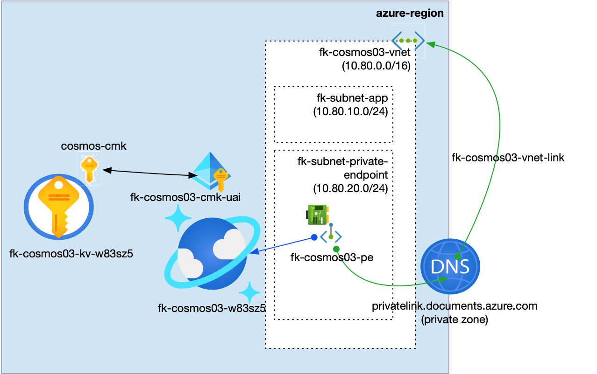
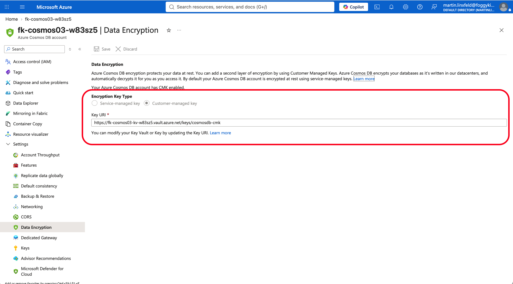
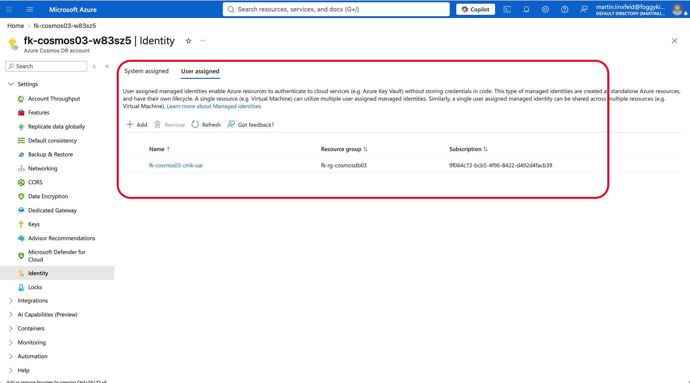
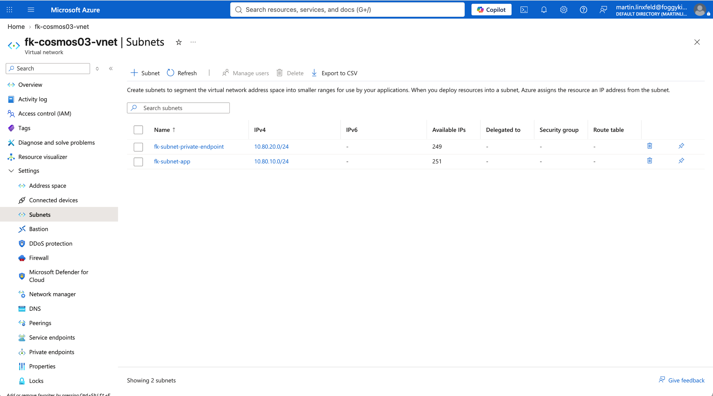
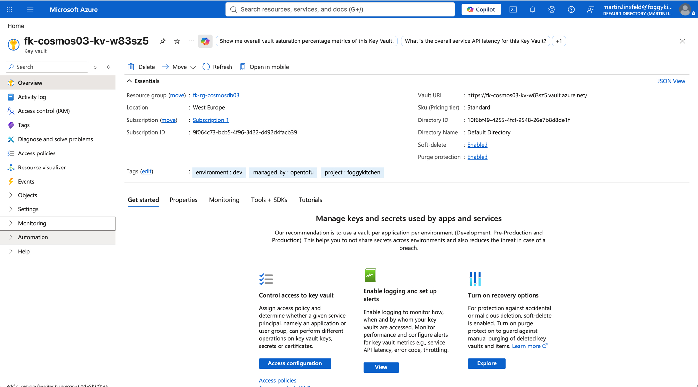
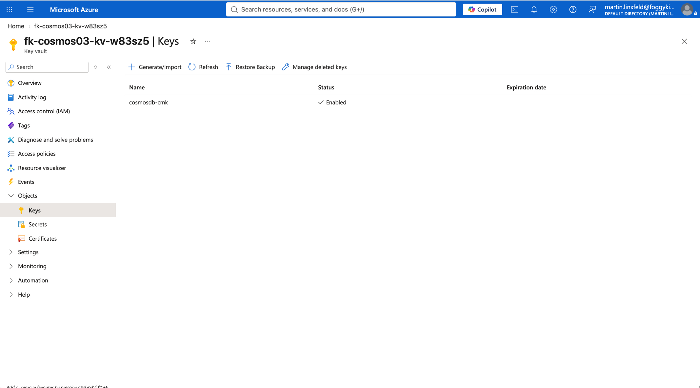
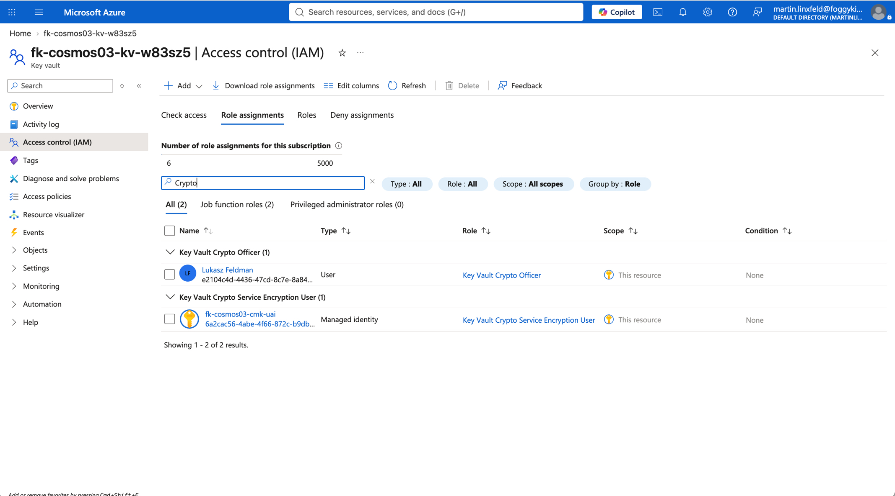
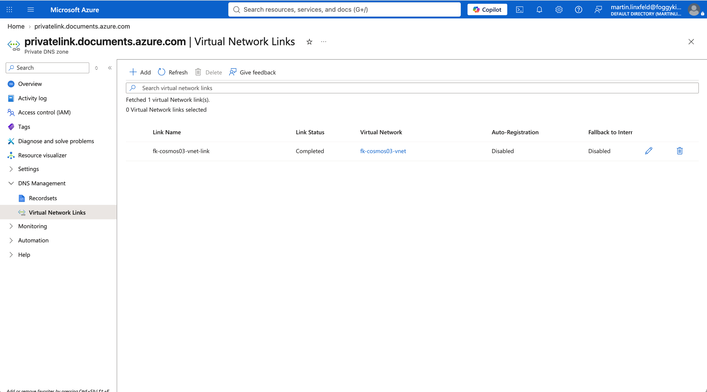

# Example 03: Customer-Managed Key Encryption

In this third Cosmos DB example, we deploy an **Azure Cosmos DB SQL API account** using
**Terraform/OpenTofu** with **customer-managed key encryption at rest**.
The account keeps the private-access baseline from Example 01 with a Private Endpoint, Private DNS
Zone, and public network access disabled, and receives a Key Vault key and user-assigned managed
identity from composed FoggyKitchen modules.

This example creates the Key Vault with `terraform-az-fk-key-vault`, creates the Key Vault key
with `terraform-az-fk-key-vault-key`, creates the user-assigned identity with
`terraform-az-fk-managed-identity`, and grants Key Vault crypto access with `terraform-az-fk-rbac`.

---

## Architecture Overview



This deployment creates:

- A dedicated **Azure Resource Group**
- One **Key Vault** using `terraform-az-fk-key-vault`
- One **RSA Key Vault key** using `terraform-az-fk-key-vault-key`
- One **user-assigned managed identity** using `terraform-az-fk-managed-identity`
- Key Vault RBAC assignments using `terraform-az-fk-rbac`
- One **Azure VNet** using `terraform-az-fk-vnet`
- One application subnet for future client workloads
- One subnet prepared for Private Endpoints
- One **Private DNS Zone** using `terraform-az-fk-private-dns`
- One **Cosmos DB SQL API account** using the local `terraform-az-fk-cosmosdb` module
- One Cosmos DB SQL database named `foggydb`
- One Cosmos DB SQL container named `items`
- One **Private Endpoint** using `terraform-az-fk-private-endpoint`
- One Private DNS Zone Group attached to the Private Endpoint

This example demonstrates the secure Cosmos DB encryption pattern where the database account uses a
user-assigned managed identity to access a versionless Key Vault key ID while private connectivity
is handled through Private Link.

---

## Deployment Steps

Copy the example variables file:

```bash
cp terraform.tfvars.example terraform.tfvars
```

No key material or secrets are hardcoded in this example. The Cosmos DB account and Key Vault names
use a random suffix because both names must be globally unique.

Initialize and apply the Terraform/OpenTofu configuration:

```bash
tofu init
tofu plan
tofu apply
```

After a successful deployment, OpenTofu will output:

- The Cosmos DB account ID, name, and endpoint
- Whether CMK encryption is enabled
- The Key Vault ID
- The versionless Key Vault key ID and resource ID
- The user-assigned managed identity ID, principal ID, and client ID
- The created SQL database and container IDs
- The Private Endpoint ID

These outputs make it easy to verify that Cosmos DB encryption is connected to the expected Key
Vault key and managed identity.

---

## Runtime Notes

The Key Vault uses Azure RBAC, soft delete, and purge protection. Purge protection is required for
Cosmos DB customer-managed keys. The principal running OpenTofu receives `Key Vault Crypto Officer`
so it can create the key, and the Cosmos DB user-assigned identity receives
`Key Vault Crypto Service Encryption User` so the service can get, wrap, and unwrap the data
encryption key.

The Cosmos DB module references the versionless Key Vault key ID so key rotation can be handled in
Key Vault without replacing the account configuration. The account sets
`default_identity_type = "UserAssignedIdentity=<identity_id>"` and assigns the same user-assigned
identity to the Cosmos DB account.

The Cosmos DB account keeps public network access disabled and is exposed through a Private Endpoint
using the SQL API Private Link subresource `Sql`.

---

## Azure Console And Runtime Verification

### Cosmos DB Data Encryption

Confirm that the Cosmos DB account data encryption uses the customer-managed key.



### Cosmos DB Identity

Confirm that the user-assigned managed identity is assigned to the Cosmos DB account.



### Cosmos DB Networking

Confirm that the Cosmos DB account uses Private access and that the Private Endpoint connection is
approved.



### Key Vault

Confirm that the Key Vault exists with soft-delete and purge protection enabled.



### Key Vault Key

Confirm that the RSA key used by Cosmos DB encryption exists in the Key Vault.



### Key Vault RBAC

Confirm that the current principal and Cosmos DB managed identity have the required Key Vault
crypto roles.



### Private DNS

Confirm that the Private DNS Zone contains `A` records for the Cosmos DB account that point to
Private Endpoint IP addresses.



---

## Cleanup

To remove all resources created by this example:

```bash
tofu destroy
```

---

## Summary

This example demonstrates:

- How to enable **customer-managed key encryption** for a Cosmos DB account
- How to create a Key Vault with `terraform-az-fk-key-vault`
- How to create a Key Vault key with `terraform-az-fk-key-vault-key`
- How to create a user-assigned managed identity with `terraform-az-fk-managed-identity`
- How to grant Key Vault crypto access with `terraform-az-fk-rbac`
- How to keep Private Endpoint access from the Cosmos DB private-access baseline
- How to keep key material, identity, and Private Endpoint concerns outside the root Cosmos DB module

---

## Learn More

Visit [FoggyKitchen.com](https://foggykitchen.com/) for Azure, OCI, multicloud, and Terraform/OpenTofu learning resources.

---

## License

Licensed under the **Universal Permissive License (UPL), Version 1.0**.
See [LICENSE](../../LICENSE) for more details.

---

© 2026 [FoggyKitchen.com](https://foggykitchen.com) - Cloud. Code. Clarity.
